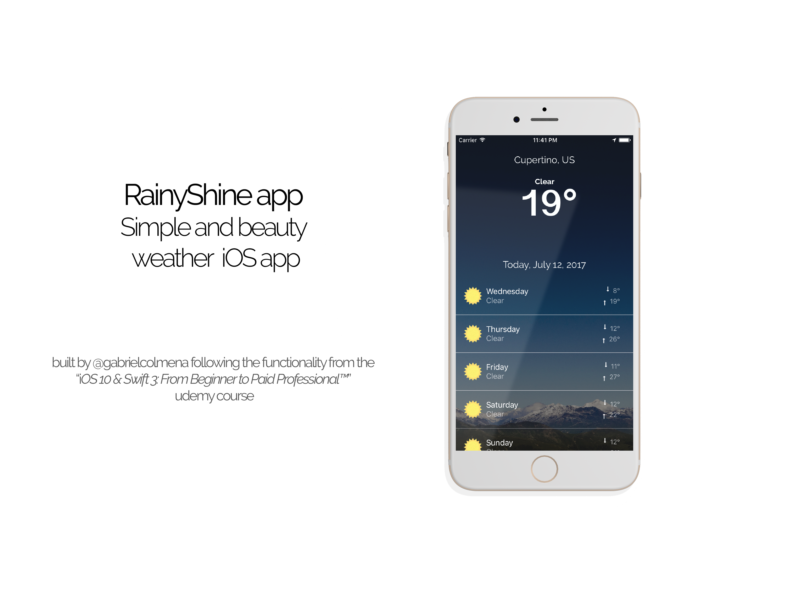

## RainyShine app ##

RainyShine is a weather app that uses 

* Auto-layout apple's system
* [Open weather map](http://openweathermap.org/) REST API to get weather data
* Alamofire library to get that data
* CoreLocation service to get the current device geolocation 
 